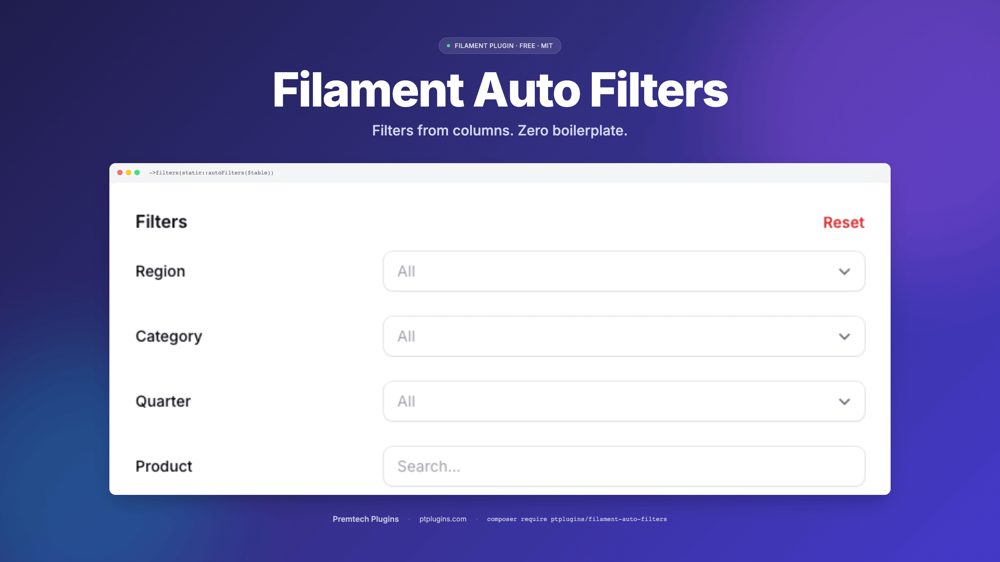

# Filament Auto Filters

<p align="center">
  
</p>

> Automatic table filters for [FilamentPHP](https://filamentphp.com/) **v3, v4, and v5** based on your column definitions. Stop writing repetitive filter code - just define your columns and get smart filters for free.

Single codebase across all three Filament major versions - same trait, same API.

<p align="center" class="filament-hidden">
  <a href="https://ptplugins.com/buy-us-a-beer"></a>
</p>

**🎯 [Try it live · ptplugins.com/demo/auto-filters](https://ptplugins.com/demo/auto-filters)** - no signup, click any column, see filters generate themselves.

## The Problem

Every Filament resource needs filters. For a typical table with 10 columns, you end up writing 10 filter definitions - most of which follow the same patterns. Date columns get date pickers, text columns get search inputs, relationships get `whereHas` queries.

**Before** (manual filters for each column):

```php
public static function table(Table $table): Table
{
    return $table
        ->columns([
            TextColumn::make('name'),
            TextColumn::make('email'),
            TextColumn::make('department.name'),
            TextColumn::make('hired_at')->date(),
            TextColumn::make('data.position'),
        ])
        ->filters([
            Filter::make('name')
                ->form([TextInput::make('value')->label('Name')])
                ->query(fn (Builder $q, array $data) => /* ... */),
            Filter::make('email')
                ->form([TextInput::make('value')->label('Email')])
                ->query(fn (Builder $q, array $data) => /* ... */),
            Filter::make('department.name')
                ->form([TextInput::make('value')->label('Department')])
                ->query(fn (Builder $q, array $data) => $q->whereRelation(/* ... */)),
            Filter::make('hired_at')
                ->form([DatePicker::make('from'), DatePicker::make('until')])
                ->query(fn (Builder $q, array $data) => /* ... */),
            Filter::make('data.position')
                ->form([TextInput::make('value')->label('Position')])
                ->query(fn (Builder $q, array $data) => /* ... using JSON arrow notation */),
        ]);
}
```

**After** (one line):

```php
->filters(static::autoFilters($table))
```

## Installation

```bash
composer require ptplugins/filament-auto-filters
```

The package auto-discovers its service provider. No manual registration needed.

### Publish Configuration (optional)

```bash
php artisan vendor:publish --tag=auto-filters-config
```

## Quick Start

Add the trait to your Filament resource and call `autoFilters()`:

```php
use PtPlugins\FilamentAutoFilters\Concerns\HasAutoFilters;

class EmployeeResource extends Resource
{
    use HasAutoFilters;

    public static function table(Table $table): Table
    {
        return $table
            ->columns([/* ... */])
            ->filters(static::autoFilters($table));
    }
}
```

That's it. Every `TextColumn` in your table now has a filter.

## Full Example: Employee Management

Let's walk through a real-world scenario. You're building an HR module with an `Employee` model that has direct columns, a `department` relationship, and a JSON `data` column for flexible fields.

### The Model

```php
class Employee extends Model
{
    // Direct columns
    const NAME = 'name';
    const EMAIL = 'email';
    const HIRED_AT = 'hired_at';
    const SALARY = 'salary';

    // JSON data column fields
    const D_POSITION = 'data.position';
    const D_OFFICE = 'data.office';

    // Relationships
    const R_DEPARTMENT_NAME = 'department.name';
    const R_MANAGER_NAME = 'manager.name';

    protected $casts = [
        'hired_at' => 'date',
        'data' => 'array',
    ];

    public function department(): BelongsTo
    {
        return $this->belongsTo(Department::class);
    }

    public function manager(): BelongsTo
    {
        return $this->belongsTo(Employee::class, 'manager_id');
    }
}
```

### The Resource

```php
use Filament\Tables\Columns\TextColumn;
use Filament\Tables\Table;
use PtPlugins\FilamentAutoFilters\Concerns\HasAutoFilters;

class EmployeeResource extends Resource
{
    use HasAutoFilters;

    protected static ?string $model = Employee::class;

    public static function table(Table $table): Table
    {
        return $table
            ->columns([
                TextColumn::make(Employee::NAME)
                    ->label('Name')
                    ->searchable(),

                TextColumn::make(Employee::EMAIL)
                    ->label('Email'),

                TextColumn::make(Employee::R_DEPARTMENT_NAME)
                    ->label('Department'),

                TextColumn::make(Employee::R_MANAGER_NAME)
                    ->label('Manager'),

                TextColumn::make(Employee::HIRED_AT)
                    ->label('Hired')
                    ->date(),

                TextColumn::make(Employee::SALARY)
                    ->label('Salary')
                    ->numeric(),

                TextColumn::make(Employee::D_POSITION)
                    ->label('Position'),

                TextColumn::make(Employee::D_OFFICE)
                    ->label('Office'),
            ])
            ->filters(static::autoFilters($table));
    }
}
```

### What Gets Generated

The plugin inspects each column and generates the right filter type. Detection rules:

| Column | Filter |
|---|---|
| `TextColumn` (date / datetime) | Date range picker (from / until) |
| `TextColumn` (default) | Text search (LIKE `%...%`) |
| `TextColumn` with dot notation `rel.col` | Text search via `whereRelation()` |
| `TextColumn` with `data.X` prefix | Text search via JSON arrow `data->X` |
| `IconColumn->boolean()` | Ternary (Yes / No / All) |
| `SelectColumn->options([...])` | Select filter with same options |
| Other column types | Skipped - pass an explicit filter via `overrides` |

For our Employee example (8 columns), all 8 filters are generated from zero lines of filter code. Same applies to a table mixing `IconColumn` and `SelectColumn` - they get their right filter automatically.

## Overriding Specific Filters

Auto-generated filters are great for most columns. But sometimes you need a `SelectFilter` with specific options, or custom logic. Pass your explicit filters as `overrides` - they replace any auto-generated filter with the same name:

```php
->filters(static::autoFilters($table, overrides: [
    // Replace the auto-generated text filter for department
    // with a select dropdown instead
    static::makeSelectFilter(
        Employee::R_DEPARTMENT_NAME,
        'Department',
        Department::pluck('name', 'name')
    ),

    // Custom filter with your own logic
    SelectFilter::make(Employee::SALARY)
        ->label('Salary Range')
        ->options([
            'junior' => 'Under 50k',
            'mid' => '50k - 100k',
            'senior' => 'Over 100k',
        ]),
]))
```

Result: `department.name` and `salary` use your custom filters. The remaining 6 columns still get auto-generated filters.

**Overrides get inline labels too.** When `inline_labels` is `true` (the default), `autoFilters()` applies `inlineLabel()` to your overrides as well, so the whole panel keeps one uniform `Label [input]` rhythm - you don't have to inline each override by hand. This works for `SelectFilter` / `TernaryFilter` overrides (like the `SelectFilter::make(Employee::SALARY)` above). An override you build with `->form([...])` is the one exception - inline those yourself (see the [note below](#uniform-inline-labels-across-every-filter-type)).

## Skipping Columns

Some columns don't need filters. Pass their names in the `skip` array:

```php
->filters(static::autoFilters($table, skip: [
    'deleted_at',
    Employee::SALARY,
]))
```

## Combining Overrides and Skips

```php
->filters(static::autoFilters($table,
    overrides: [
        static::makeSelectFilter(
            Employee::R_DEPARTMENT_NAME,
            'Department',
            Department::pluck('name', 'name')
        ),
    ],
    skip: [
        'deleted_at',
    ]
))
```

**Rules:**
1. Filters come out in **column order** - the panel mirrors the table header
2. An override takes the slot of the column it replaces (matched by original name or `filterName()` slug); overrides matching no column are appended last
3. Columns in the `skip` list are skipped
4. Everything else gets an auto-generated filter

## Distinct-Value Select Filters

A text filter is the safe default, but users often want a dropdown of *the values that actually exist* - e.g. a multi-select of the cost amounts present on one event. Opt in with `distinct`:

```php
// Every plain text column becomes a multi-select of its distinct values,
// except the free-text ones you list
->filters(static::autoFilters($table,
    distinct: true,
    except: ['notes', 'description'],
))

// ...or only the columns you name (direct, JSON data.key or relation.column)
->filters(static::autoFilters($table,
    distinct: ['cost', 'data.city', 'department.name'],
))
```

How it behaves:
- Options are the distinct, non-null values from the **table's own query** - scopes and constraints (e.g. a relation manager's owner record) are kept, ordering and eager loads are dropped. Values are sorted naturally and used as both key and label.
- Date columns are never converted.
- A column with **no values**, or with more than `distinct_max_options` (default `50`) distinct values, silently stays a text filter - a 5000-row list never gets a 5000-option select.
- Options are resolved when the filters are built (one `SELECT DISTINCT` per column). On large tables name a few columns instead of `distinct: true`, or supply your own resolver:

```php
->filters(static::autoFilters($table,
    distinct: static::costColumns(),
    distinctOptionsUsing: fn (string $column, Table $table): array => Cache::remember(
        "rm_cost_opts:{$this->getOwnerRecord()->getKey()}:{$column}",
        now()->addHour(),
        fn () => $table->getQuery()->distinct()->pluck($column)->all(),
    ),
))
```

The resolver receives the original column name and returns either a flat list of values (sorted naturally, value doubles as label) or a ready `value => label` map when you want formatted labels (order and labels kept as-is). `null` / empty values are dropped and the threshold still applies.

## API Reference

### `autoFilters(Table $table, array $overrides = [], array $skip = [], bool|array $distinct = false, array $except = [], ?Closure $distinctOptionsUsing = null): array`

The main method. Inspects every column in the table, in column order, and generates an appropriate filter for `TextColumn`, `IconColumn->boolean()`, and `SelectColumn`. Other column types are skipped - pass them explicitly via `overrides`. See [Distinct-Value Select Filters](#distinct-value-select-filters) for `distinct`, `except` and `distinctOptionsUsing`.

### `makeDistinctSelectFilter(Table $table, string $name, string $label, ?Closure $optionsUsing = null): ?SelectFilter`

Builds a multi-select of a column's distinct values, or returns `null` (caller falls back to a text filter) when there are none or more than `distinct_max_options`.

### `distinctColumnValues(Table $table, string $name): array`

Distinct non-null values of a direct / JSON / relationship column in the table's current query.

### `makeTernaryFilter(string $name, string $label): TernaryFilter`

Creates a yes/no/all ternary filter for a boolean column. Handles direct, JSON, and relationship columns the same way as the other helpers.

### `makeSelectFilter(string $name, string $label, array|Closure $options): SelectFilter`

Creates a select dropdown filter that automatically handles:
- **Direct columns** - standard `whereIn` query
- **JSON columns** (`data.xxx`) - uses `attribute()` with arrow notation
- **Relationship columns** (`rel.col`) - uses `whereHas` query

By default, select filters are multiple-choice and searchable (configurable).

### `makeDateRangeFilter(string $name, string $label): Filter`

Creates a date range filter with "from" and "until" date pickers. Handles relationship and JSON columns the same way.

### `makeTextFilter(string $name, string $label): Filter`

Creates a text search filter (LIKE contains). Handles relationship and JSON columns automatically.

### `resolveColumn(string $name): array`

Resolves a column name into its type and query components. Used internally, but available if you need to build custom filters with the same column-detection logic.

Returns:
- `['type' => FilterType::Direct, 'query_column' => 'name']`
- `['type' => FilterType::Relationship, 'relationship' => 'department', 'column' => 'name']`
- `['type' => FilterType::Json, 'query_column' => 'data->position']`

## Configuration

Publish the config file to customize defaults:

```bash
php artisan vendor:publish --tag=auto-filters-config
```

```php
// config/auto-filters.php
return [
    'text_search_placeholder' => 'Search...', // Placeholder for text inputs
    'date_format'             => 'd.m.Y',     // Display format in filter indicators
    'select_multiple'         => true,         // Allow multi-select by default
    'select_searchable'       => true,         // Searchable dropdowns by default
    'inline_labels'           => true,         // Apply ->inlineLabel() to every auto-filter
    'prefer_pikaday'          => false,        // Use Pikaday for date filters when installed
    'sanitize_names'          => true,         // Slug unsafe (dotted/spaced) column names
    'distinct_max_options'    => 50,           // Max distinct values for a `distinct` select
];
```

### Optional: Pikaday date picker

Date range filters use Filament's native `DatePicker` by default. If you install the lightweight [`ptplugins/filament-pikaday`](https://packagist.org/packages/ptplugins/filament-pikaday) package (no jQuery, no moment.js), you can route every auto-generated date filter through it instead - set `prefer_pikaday => true`:

```bash
composer require ptplugins/filament-pikaday
```

```php
// config/auto-filters.php
'prefer_pikaday' => true,
```

The flag is a no-op when Pikaday isn't installed - auto-filters falls back to the native `DatePicker` automatically, so it's safe to enable in shared config.

`inline_labels` defaults to `true` because that's what pairs best with the recommended slide-over panel below. Set it to `false` if you keep the default Filament dropdown layout (the dropdown is narrow and inline labels can look cramped) or if you simply prefer stacked labels.

## Recommended UX: Slide-Over Panel + Inline Labels

Out of the box Filament renders filters as a dropdown attached to a small "Filter" button - fine for one or two filters, cramped once a table has six or more. With auto-generated filters every column suddenly *has* a filter, so the dropdown stops scaling.

By default the trait applies `inlineLabel()` to every form field it generates (label on the left of the input, single row per filter - controlled by `inline_labels` in the config). That layout is *tuned for a wide panel* - pair it with a **slide-over** on the Resource and you get a "Linear / Notion"-style filter sidebar like our [live demo](https://ptplugins.com/demo/auto-filters):

```php
use Filament\Tables\Table;

public static function table(Table $table): Table
{
    return $table
        ->columns([/* ... */])
        ->filters(static::autoFilters($table))
        ->filtersFormWidth('md')                         // sm | md | lg | xl
        ->filtersTriggerAction(
            fn ($action) => $action->slideOver(),         // open on the right
        );
}
```

**What changes for the user:**

- Click **Filter** → panel slides in from the right.
- Each filter is one row: `Label  [input]` (from `inlineLabel()`).
- Apply / Reset live in the panel footer; close = `Esc` or click outside.
- Table reclaims the vertical space the old dropdown took.

This is purely Filament's `Table` API - no extra CSS, no Livewire plumbing. The trait stays focused on filter *generation*; this snippet is the matching *presentation*.

### Uniform inline labels across every filter type

When `inline_labels` is `true` (the default), every auto-generated filter renders with an inline label on the left and the input on the right, including the awkward cases that don't accept `inlineLabel()` directly:

| Filter type | How inline label is applied |
|---|---|
| Text search (`makeTextFilter`) | `TextInput::inlineLabel()` in the filter's `->form()` schema |
| Date range (`makeDateRangeFilter`) | **Two stacked rows** (`Date from`, `Date until`) - both `DatePicker::inlineLabel()`. Avoids the asymmetric "label only on first input" layout that a single-row layout produces. |
| Select (`makeSelectFilter`) | `SelectFilter::modifyFormFieldUsing(fn ($f) => $f->inlineLabel())` (SelectFilter doesn't have a `->form()` we can put `inlineLabel()` on directly) |
| Ternary (`makeTernaryFilter`) | Same as Select - `TernaryFilter::modifyFormFieldUsing(fn ($f) => $f->inlineLabel())`. Filament's `TernaryFilter` builds its own form schema, so the regular `inlineLabel()` on a child component would never reach it. |
| Overrides (`SelectFilter` / `TernaryFilter`) | `autoFilters()` runs the shared `applyInlineLabel()` helper over every override you pass, so a hand-built `SelectFilter::make(...)` matches the auto-generated ones with no extra code. |

Result: every row in the slide-over reads as `[Label]  [input]` - same vertical rhythm whether the column behind it is text, date, boolean, select, JSON, or a relationship, and whether it was auto-generated or supplied as an override.

Set `inline_labels => false` in the published config to skip all of the above and get stacked labels instead - better suited to the default dropdown layout.

> **The one case `autoFilters()` can't inline for you:** an override built with `Filter::make()->form([...])`. Filament returns a user-supplied form schema verbatim and never runs `modifyFormFieldUsing` on it, so `applyInlineLabel()` (and therefore the override pass) is a no-op there. Add `->inlineLabel()` to every form component in the schema yourself - exactly as the package's own text and date filters do.

## How Column Detection Works

The plugin uses a simple naming convention to detect column types:

```
name            → Direct column    → WHERE name LIKE '%...%'
hired_at        → Date column      → WHERE hired_at >= ? AND hired_at <= ?
department.name → Relationship     → whereHas('department', fn($q) => $q->where('name', ...))
data.position   → JSON column      → WHERE data->position LIKE '%...%'
```

- **Dot notation** with a `data.` prefix → JSON arrow notation
- **Dot notation** without `data.` prefix → Eloquent relationship
- **No dots** → direct database column
- **Date/DateTime** detection uses Filament's built-in `isDate()` / `isDateTime()` methods on `TextColumn`

## Requirements

- PHP 8.2+
- FilamentPHP **3.x, 4.x, or 5.x** (single codebase across all three)
- Laravel 10, 11, or 12

## License

MIT
